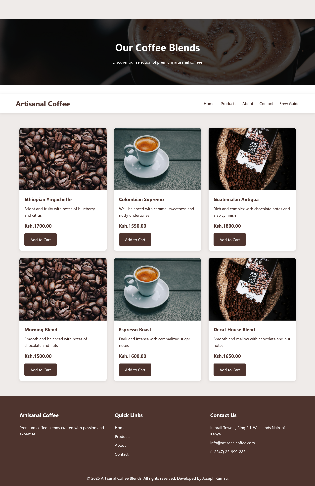
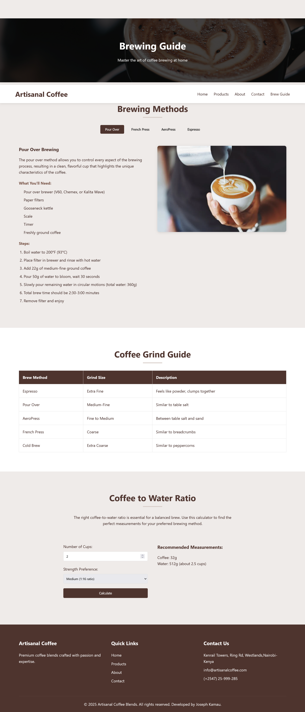

# Artisanal Coffee Blends Website

A professional, responsive multi-page website for Artisanal Coffee Blends—a premium coffee brand. This project showcases the brand's story, products, and expert brewing guides, providing an engaging and modern user experience.

## Table of Contents
- [Project Overview](#project-overview)
- [Features](#features)
- [Screenshots](#screenshots)
- [Project Structure](#project-structure)
- [Technologies Used](#technologies-used)
- [Getting Started](#getting-started)
- [Deployment](#deployment)
- [Contributing](#contributing)
- [License](#license)

## Project Overview
Artisanal Coffee Blends Website is designed to:
- Present a visually appealing and user-friendly interface for a coffee business
- Highlight premium coffee products and their unique stories
- Educate users with a detailed brew guide
- Enable easy contact and newsletter subscription

## Features
- **Fully Responsive Design:** Optimized for mobile, tablet, and desktop
- **Multi-Page Layout:** Home, Products, About, Contact, and Brew Guide
- **Interactive Product Filtering:** Users can filter coffee blends by type
- **Mobile Navigation:** Hamburger menu for seamless mobile experience
- **Newsletter Subscription:** Email validation and user feedback
- **Contact Form:** Easy-to-use form for customer inquiries
- **Consistent Branding:** Cohesive look and feel across all pages

## Screenshots




## Project Structure
```
artisanal-coffee/
├── index.html         # Home page
├── products.html      # Products listing
├── about.html         # Brand story
├── contact.html       # Contact form
├── brew-guide.html    # Brewing guide
├── css/
│   ├── style.css      # Main styles
│   └── responsive.css # Responsive styles
├── js/
│   └── script.js      # JavaScript functionality
├── images/            # Image assets
└── README.md          # Project documentation
```

## Technologies Used
- **HTML5**
- **CSS3** (Flexbox, Grid, CSS Variables)
- **JavaScript (ES6+)**
- **Responsive Web Design**

## Getting Started
1. **Clone the repository:**
   ```sh
   git clone <repo-url>
   ```
2. **Navigate to the project folder:**
   ```sh
   cd artisanal-coffee
   ```
3. **Open `index.html` in your browser** (or use Live Server in VS Code for best experience).

## Deployment
This website can be deployed on any static hosting platform, such as:
- GitHub Pages
- Netlify
- Vercel
- Firebase Hosting

### Live Demo
[View the live site](https://artisanalcoffee.vercel.app/)

## Contributing
Contributions are welcome! Please fork the repository and submit a pull request for review.

## License
This project is licensed under the MIT License.

---

> Developed by Joseph Kamau, 2025

